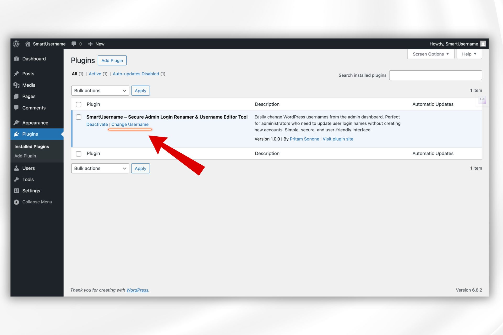
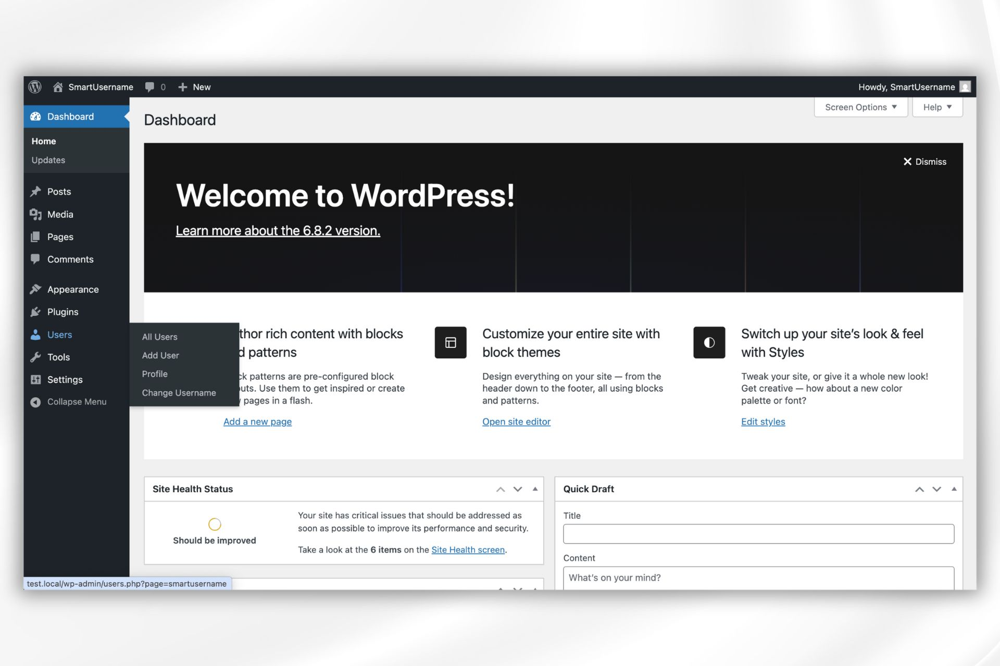
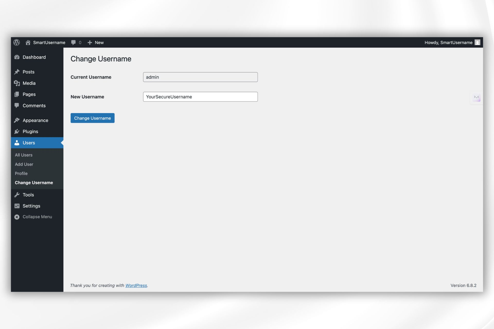
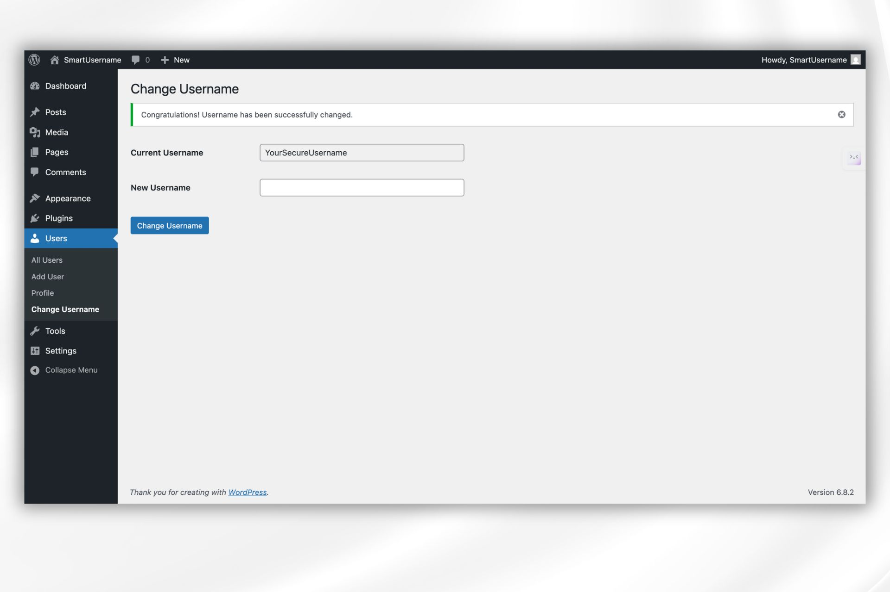

  

  
  
  
  
  
  

# SmartUsername – Secure & Simple Username Changer for WordPress 🔐

**SmartUsername** allows WordPress administrators to change any user’s username directly from the dashboard — without coding or database edits.

---

## ✨ Features

- ✅ Change usernames easily and safely from the WP Admin Panel
- 🔐 Designed with security and permission checks
- 🎯 Admins only — restricts non-admin access
- 🌐 Clean UI integrated into WP dashboard
- 🛠️ Fully localized and translation-ready
- 🧩 Compatible with major plugins and themes
- 💨 Lightweight and fast – no bloat

---

## 📸 Screenshots

> These images show the plugin in action within the WordPress dashboard.

### 1. Plugins Page with SmartUsername Plugin  

### 2. Dashboard Navigation  

### 3. Change Username Modal  

### 4. Confirmation Message  

---

## 🚀 Installation

1. Download the plugin ZIP (`smartusername.zip`)
2. Go to your WordPress admin dashboard → Plugins → Add New → Upload Plugin
3. Select the zip file and click Install Now
4. Activate the plugin
5. Navigate to **Users → Change Username** in the sidebar

---

## 💡 Use Cases

- Rename insecure usernames like `admin` or `user123`
- Quickly fix naming issues after site migrations
- Help clients personalize user accounts
- Improve login security with unique usernames

---

## 📄 Requirements

- WordPress 5.0+
- PHP 7.2+
- Admin-level access

---

## 🛡️ Security & Privacy

- Fully sanitizes and validates inputs
- Checks current user capabilities before applying changes
- Reports or issues can be sent via GitHub or [Security Policy](SECURITY.md)

---

## 👨‍💻 Developer

Crafted by [Pritam Sonone](https://github.com/DigitalPritam1)  
🔗 [WordPress Profile](https://profiles.wordpress.org/digitalpritam1)  
🌐 [Website](https://www.digitalpritam.in)  
🎥 [YouTube – Digital Pritam](https://www.youtube.com/@DigitalPritam)  
👨‍🌾 [Amhi Kastkar](https://www.youtube.com/@AmhiKastkar)

---

## 💸 Support & Donations

If this plugin helped you, feel free to support development:  
[☕ Buy me a coffee](https://www.buymeacoffee.com/pritamsonone)

---

## 📦 License

SmartUsername is open-sourced software licensed under the [GPLv2 or later](LICENSE).

---

> Plugin Slug: `smartusername`  
> Tags: username, change username, user management, admin tools, security
